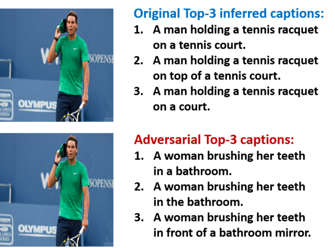

# Show and Fool: Crafting Adversarial Examples for Neural Image Captioning

A TensorFlow implementation of the adversarial examples generating models described in the paper:

"Show and Fool: Crafting Adversarial Examples for Neural Image Captioning"

Hongge Chen\*, Huan Zhang\*, Pin-Yu Chen, Jinfeng Yi and Cho-Jui Hsieh


Full text available at: (arxiv link)


## Introduction

The *Show-and-Fool* model is designed to generate adversarial examples for neural image captioning. Our model is based on  [Show and Tell](https://github.com/tensorflow/models/tree/master/research/im2txt). 

For example:




## Getting Started

First please clone this directory.

### Run Single Demo Attacks on MSCOCO Dataset
You can use 

```bash run_show_and_fool_demo.sh. ``` 

to do a quick attack on a single image. You are required to provide 4 parameters: 

```ATTACK_FILEPATH```, ```TARGET_FILEPATH```, ```OUTPUT_DIR```, ```GPU_number```

```ATTACK_FILEPATH``` is the attacked image's path and ```TARGET_FILEPATH``` is the targeted image's path. ```OUTPUT_DIR``` is the directory in which you save the results. We also add a /fail_log directory in the result directory to save the log to failed attacks. ```GPU_number``` is the index of the GPU you want to use (optional). We also provide you some demo images from MSCOCO. You can find them in ```im2txt/demo_image```. Before you run, please go to run_attack.sh and specify 2 paths:

(i) ```${VOCAB_FILE}``` is the path to vocabulary file generated by the preprocessing script. (it should be a word_counts.txt)

(ii) ```${CHECKPOINT_PATH}``` is the path to the checkpoint file.

In this code we provide 4 attack modes: targeted caption attack, untargeted caption attack, targeted keyword attack and untargeted keyword attack. We have two boolean parameters to control the attack mode, ```use_keywords``` and ```targeted```. 
For example, ```--use_keywords=False``` and ```--targeted=True``` give you targeted caption attack. If you are using untargeted attack please use ```ATTACK_FILEPATH``` also as ```TARGET_FILEPATH```. 

We also have a parameter ```use_logits``` for you to choose between the logits loss or log-prob loss. To use logits loss, simply add ```--use_logits=True``` and to use log-prob loss, add ```--use_logits=False```. The detailed form of our losses can be find in our paper. There are other parameters for you to tune, such as number of iterations, initial constant C, norm (l2 or l_infinity) and beam search size. You can check ```run_attack_BATCH_search_C.py``` for details.


### Run Multiple Attacks on MSCOCO Dataset
To run multiple attacks on MSCOCO dataset, you need to do ```bash run_attack.sh. ``` It is similar to ```bash run_show_and_fool_demo.sh. ```. But before you do this, please go to run_attack.sh and specify 4 paths:

(i) ```${VOCAB_FILE}``` is the path to vocabulary file generated by the preprocessing script. (it should be a word_counts.txt)

(ii) ```${CHECKPOINT_PATH}``` is the path to the checkpoint file.

(iii) ```${CAPTION_FILE}``` is the path to the validation set's caption file (for example ../coco-caption/annotations/captions_val2014.json)

(iv) ```${IMAGE_DIRECTORY}``` is the directory of MSCOCO validation set (for example ../mscoco/image/val2014/)

There are 4 required parameters, ```OFFSET```, ```NUM_ATTACKS```, ```OUTPUT_DIR```, and ```GPU_number```. When we do the experiments on MSCOCO validation set, we first randomly shuffle the images. Then we pick images in this queue one by one to ```NUM_ATTACKS``` detemines the number of experiments. One experiment means attack on one image. ```OFFSET``` determines the index of the first image to be attacked. ```OUTPUT_DIR``` is the directory in which you save the results. We also add a /fail_log directory in the result directory to save the log to failed attacks. ```GPU_number``` is the index of the GPU you want to use (optional). 

 


